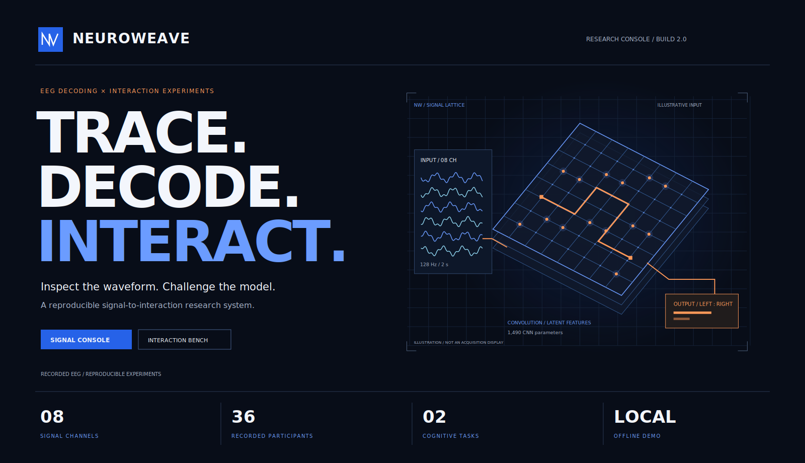
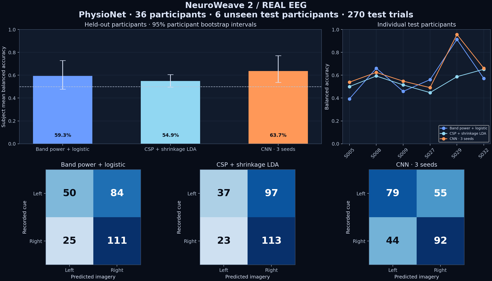
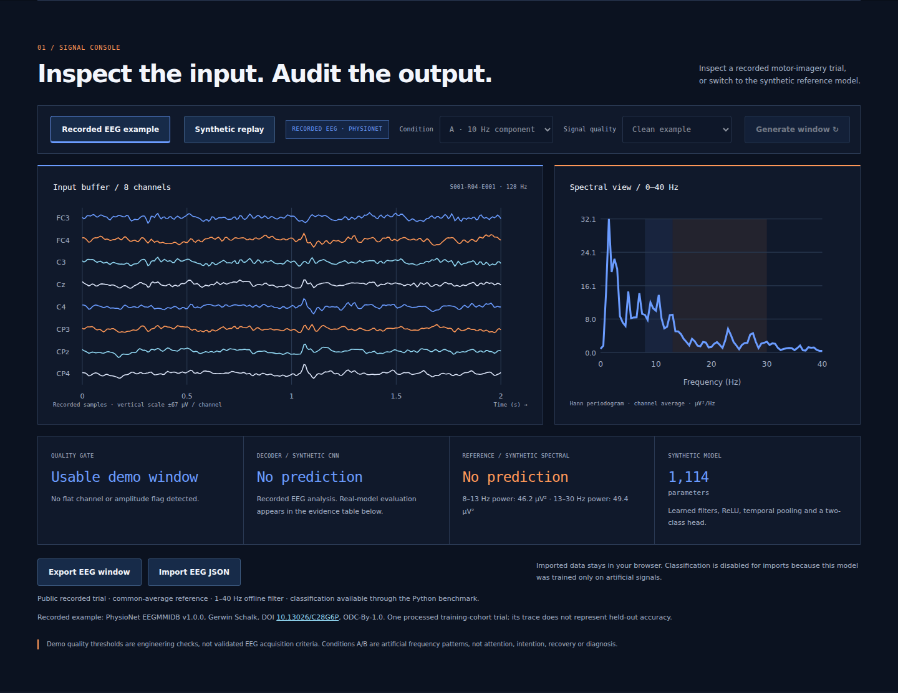

# NeuroWeave 2

**Real EEG. Unseen participants. Inspectable experiments.**

NeuroWeave connects EEG decoding, compact convolutional models and cognitive
task design. Version 2 adds a reproducible **left/right motor-imagery experiment
on recorded PhysioNet EEG**, with separate people for training, validation and
testing. The offline console displays a recorded EEG example, the benchmark
results and two self-paced interaction tasks.

This portfolio project continues Sarvenaz Mahmoudzadeh Khameneh's MSc focus on
*deep learning with convolutional neural networks for EEG decoding*. It makes
the signal-processing, model-comparison and evaluation workflow reviewable in
code. The PhysioNet experiment is new work in this repository, separate from
the historical thesis and its experimental results.

[Open the offline demo](dist/index.html) · [Real EEG protocol](docs/REAL_EEG_PROTOCOL.md) ·
[Dataset card](docs/DATASET_CARD.md) · [Model card](docs/MODEL_CARD.md) ·
[Validation record](VALIDATION.md)

## What changed in version 2

| Component | Implemented evidence |
| --- | --- |
| Public recorded EEG | PhysioNet EEGMMIDB v1.0.0, 36 people, three imagery runs per person |
| Subject-independent split | 24 training people, 6 validation people, 6 unseen test people |
| Classical references | Log-band-power logistic regression and regularized CSP + shrinkage LDA |
| Convolutional model | EEGNet-style PyTorch CNN, 1,490 trainable parameters, three seeds |
| Audit trail | Source SHA-256 hashes, epoch acceptance/rejection, trial probabilities and checkpoints |
| Evaluation | Subject-mean balanced accuracy, participant bootstrap intervals and paired differences |
| Offline console | Recorded EEG replay, real benchmark table, synthetic comparison and cognitive tasks |

## Recorded EEG benchmark

The task is **imagined left versus right fist movement**, using runs **04, 08
and 12**. Labels come from EDF+ annotations. One two-second epoch is extracted
from 1 to 3 seconds after each imagery cue. All trials from one person stay in
the same split.

<!-- REAL_RESULTS_START -->
**1,620 recorded trials**, 108 verified EDF files. All trials passed the fixed QC policy:
1,080 train, 270 validation and **270 test trials**.

| Model | Subject mean balanced accuracy | 95% participant bootstrap interval |
| --- | --- | --- |
| Band power + logistic | 59.30% | 47.70–72.85% |
| CSP + shrinkage LDA | 54.90% | 49.60–60.59% |
| Compact CNN (3-seed ensemble) | 63.65% | 53.71–77.10% |

CNN minus band-power reference: **+4.35 percentage points**,
paired 95% interval **-1.90 to +10.05 points**. The interval includes zero;
this pilot does not establish that the CNN reliably outperforms the band-power reference.
<!-- REAL_RESULTS_END -->



The primary score gives each held-out person equal weight. Intervals resample
people, not individual trials. A six-person test cohort gives limited evidence
about population generalization; three CNN seeds measure training sensitivity
on the same split. A weaker or inconclusive CNN result is reported as such.
This experiment does not establish a universal advantage for deep learning.

See the [complete protocol](docs/REAL_EEG_PROTOCOL.md),
[trial predictions](reports/physionet-pilot/predictions.csv),
[QC audit](reports/physionet-pilot/epoch-audit.csv), and
[machine-readable benchmark](reports/physionet-pilot/benchmark.json).

## Try the console

Open **`dist/index.html`** directly in a browser; no server, account or API key
is needed. Select **Recorded EEG example** to inspect a processed public trial.
The waveform uses the real motor-channel labels. The console displays the
precomputed real benchmark separately from live synthetic-model predictions.

Use **Synthetic replay** to switch between artificial 10/20 Hz conditions,
inject an amplitude artefact or flatten a channel. The original NumPy CNN and
JavaScript forward pass remain a numerical reference harness. Both models
score 100% on this deliberately simple synthetic task; this is not the real
EEG result. Imported windows and recorded EEG replay are never classified by
the synthetic-trained model.

**Sequence Buffer** records eight memory trials with 2–4 symbols. **Rule
Router** alternates MATCH/OPPOSITE rules. Both support keys 1–4, pause, reduced
motion and adjustable response pads. The ledger exports local responses as
JSON/CSV. EEG observations and task responses remain separate; predictions do
not change task difficulty. State stays in memory until export.



The screenshot shows the implemented console. A [mobile rendering](docs/media/console-mobile.png)
is also included; physical-device touch and assistive technology still require testing.

## Verify the packaged results

Use **Python 3.12**. Install the scientific dependencies and pinned CPU PyTorch:

```bash
python3 -m venv .venv
source .venv/bin/activate
python -m pip install -r requirements-real.txt
python -m pip install torch==2.10.0 --index-url https://download.pytorch.org/whl/cpu
python -m research.real_eeg.verify --check-code
python -m research.real_eeg.predict
python -m unittest discover -s tests -p 'test_*.py' -v
```

Verification needs no raw-data download: it checks artifact hashes, split
membership, QC coverage, and recomputes metrics and intervals from saved trial
predictions. The prediction command replays the exported models on the recorded
example. Re-running training is a separate, stronger reproduction step.

For the interface, use **Node.js 24+**:

```bash
npm ci --ignore-scripts
npm run check
```

The build embeds console code, the recorded example, synthetic model weights
and a real-report summary into a standalone HTML file. jsdom is a development
dependency; the browser app has no third-party runtime packages or upload endpoint.

## Reproduce training on the real recordings

Only selected EDF runs are downloaded: approximately 270 MiB for the 36-person
pilot. Files are checked against PhysioNet's official SHA-256 index, including
cached files. Network/verification errors stop execution.

```bash
python -m research.real_eeg.download --config configs/physionet-pilot.json
OPENBLAS_NUM_THREADS=1 python -m research.real_eeg.train --config configs/physionet-pilot.json --output reports/runs/physionet-pilot-repeat
python -m research.real_eeg.verify --report-dir reports/runs/physionet-pilot-repeat --check-code
python -m research.real_eeg.plot_report --report-dir reports/runs/physionet-pilot-repeat --media-dir reports/runs/physionet-pilot-repeat/figures
```

A fresh output directory prevents mixing runs. Raw EEG and repeat runs are
git-ignored. CPU execution is supported; recorded timings are in the benchmark
JSON. Small numerical differences can occur across hardware and library builds
despite fixed seeds and deterministic PyTorch algorithms.

`configs/physionet-full.json` declares all 109 public subjects with a separate
fixed split. The full-cohort experiment is **not reported as completed** here;
strict sample-rate, channel and per-subject checks can stop on unusual source
records. Review those cases and document any revised eligibility protocol
before evaluating a full-cohort model. Use a separate output directory.

On Windows, activate with `.venv\Scripts\activate`; the optional
`OPENBLAS_NUM_THREADS` setting uses the syntax of your shell.

## Repository guide

| Path | Contents |
| --- | --- |
| `research/real_eeg/` | Verified downloader, preprocessing, baselines, CNN, evaluation and replay |
| `configs/` | Fixed subject splits and training settings |
| `reports/physionet-pilot/` | Real results, predictions, QC, source manifest, models and example |
| `research/neuro.py`, `research/train.py` | Original seeded synthetic NumPy benchmark |
| `models/tinycnn.json` | Synthetic-only weights used in the browser |
| `src/`, `dist/index.html` | Source and self-contained offline console |
| `tests/` | Numerical, provenance, split-integrity, model-replay and DOM checks |
| `docs/` | Research cards, protocol, architecture, data contracts and scientific figures |

This is an offline research benchmark and interaction prototype. Hardware EEG
acquisition, real-time decoding, human usability studies and an Android-native
integration are future work. Task responses measure screen interactions.

Source code and original artwork use [MIT](LICENSE). Public EEG derivatives
retain [dataset attribution and licensing](LICENSE_DATA.md).
[References](docs/REFERENCES.md) and [CITATION.cff](CITATION.cff) identify the
sources of the data and architecture.
