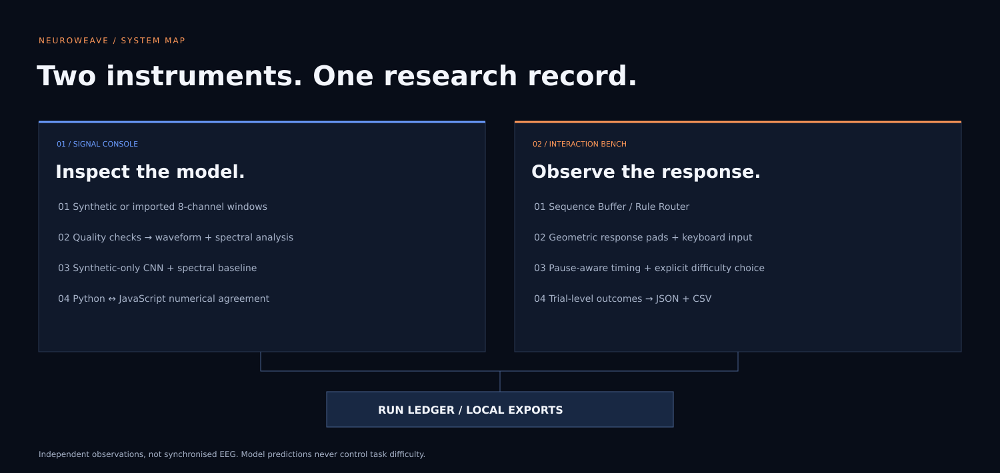
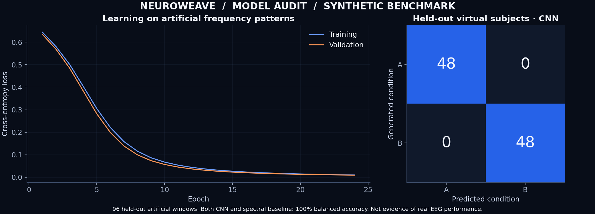
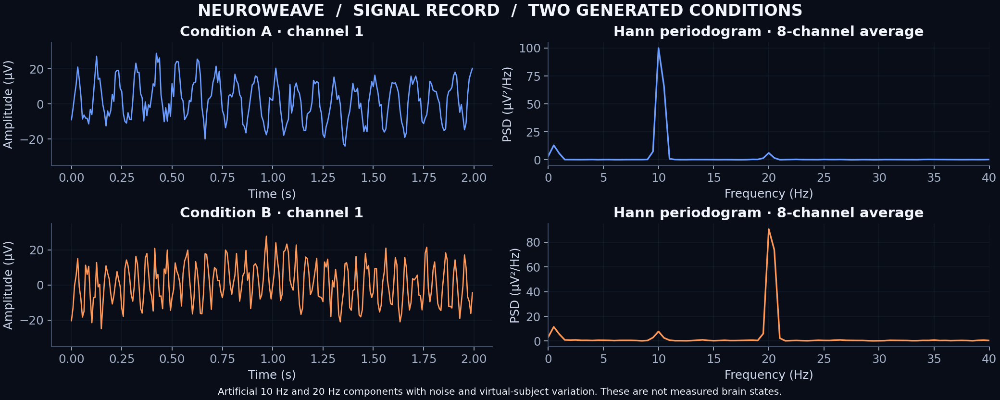

# NeuroWeave

**TRACE / DECODE / INTERACT**

A signal-decoding and interaction research console. Inspect artificial EEG, compare a learned decoder with a transparent baseline, and record structured cognitive tasks in one offline application.

[Run locally](#run-locally) · [Model card](docs/MODEL_CARD.md) · [Dataset card](docs/DATASET_CARD.md) · [Technical references](docs/REFERENCES.md)

| Version | Signal pipeline | Interaction modules | Runtime |
| --- | --- | --- | --- |
| **1.1.0** | Eight-channel analysis and a trainable CNN | Sequence Buffer and Rule Router | Self-contained HTML |

## Console modules

The **Signal Console** exposes input quality, waveform structure, spectral features and a trained temporal CNN. The **Interaction Bench** supplies two self-paced tasks with geometric response pads and explicit state transitions. The **Run Ledger** records completed trials and independent signal observations. EEG predictions never set task difficulty.

| Component | Implemented behavior |
| --- | --- |
| **Sequence Buffer** | Hold 2–4 symbols in memory and reproduce their order; eight self-paced trials |
| **Rule Router** | Route a cue through MATCH or OPPOSITE rules, switching every two trials |
| **Interaction settings** | 88/112 px targets, text and shape cues, keyboard input, pause and reduced motion |
| **Explicit adaptation** | Memory-length suggestions after four comparable rounds; acceptance is logged |
| **Run Ledger** | Correctness, response time, input method, pause time and target geometry; JSON/CSV export |
| **Signal Console** | Eight-channel waveforms, Hann periodogram and integrated band powers |
| **Quality gate** | Reject malformed/non-finite windows; abstain on flat channels or excessive amplitude |
| **Model comparison** | Trained 1,114-parameter temporal CNN and a training-fitted spectral baseline |
| **Local import** | Strict 8 × 256 JSON contract; quality and spectral analysis with classification disabled |
| **Research pipeline** | Seeded data, separate virtual-subject splits, trained weights and numerical reference fixtures |



The cover and system map are original vector illustrations, not interface screenshots. The design system uses midnight surfaces, cobalt actions, amber signal paths and a geometric signal lattice; see [Visual identity](docs/VISUAL_IDENTITY.md).

## Run locally

1. Open [dist/index.html](dist/index.html) in a browser.
2. In **Signal Console**, switch between conditions A/B and inspect the waveform, spectrum and model outputs.
3. Inject an amplitude artefact or a flat channel to inspect abstention behavior.
4. In **Interaction Bench**, select a task, load a trial and use the response pads or keys **1–4**.
5. In **Run Ledger**, inspect completed trials and export JSON/CSV.

No account, server, headset or API key is needed. All runtime assets are embedded. State is held in memory until exported; reloading resets the session. There is no EEG hardware acquisition or application data-upload endpoint.

## Reproducible benchmark

The included benchmark contains **576 artificial windows**, **18 virtual subjects**, eight channels and 256 samples per window at 128 Hz. Conditions A/B use deliberately separable 10 Hz / 20 Hz components with noise and nuisance variation. The labels are artificial frequency conditions, not mental states or diagnoses.

| Split | Virtual subjects | Windows | Role |
| --- | --- | --- | --- |
| Train | 01–12 | 384 | Fit CNN weights and baseline centers |
| Validation | 13–15 | 96 | Select the CNN checkpoint by cross-entropy loss |
| Test | 16–18 | 96 | Evaluate the selected checkpoint |

The packaged benchmark reports **100% balanced accuracy for both the CNN and spectral baseline**. This easily separable synthetic task demonstrates pipeline operation; it does not establish CNN superiority or performance on real EEG.





The [model card](docs/MODEL_CARD.md), [dataset card](docs/DATASET_CARD.md) and [machine-readable report](reports/synthetic-benchmark.json) specify the generator, training procedure and limitations.

## Development and verification

Use **Node.js 24 or newer**:

```bash
npm ci --ignore-scripts
npm run check
```

This builds the standalone demo, runs 21 JavaScript/DOM tests and checks local documentation links. jsdom is a development dependency; the demo has no third-party runtime packages.

Use **Python 3.12** for the numerical reference and model training:

```bash
python3 -m venv .venv
source .venv/bin/activate
python -m pip install -r requirements.txt
python -m unittest discover -s tests -p 'test_*.py' -v
```

To retrain and regenerate the benchmark intentionally:

```bash
OPENBLAS_NUM_THREADS=1 python research/train.py
python research/plot_report.py
npm run build
```

On Windows, activate the environment with `.venv\Scripts\activate` and set the optional `OPENBLAS_NUM_THREADS` variable using the shell's syntax. No GPU is required. NumPy implements convolution, backpropagation and Adam directly. The compact CNN is a custom architecture, not EEGNet.

The six Python tests cover gradients, virtual-subject isolation, spectral energy and saved-model evaluation. JavaScript tests also compare Python/JavaScript inference, validate imports and exercise task state transitions. See [VALIDATION.md](VALIDATION.md) for exact scope and outstanding device checks.

## Research boundaries

The task interface records screen selections; it does not measure joint angles, physical rehabilitation progress or cognitive recovery. Signals are artificial unless imported. Imported signals are never classified by the synthetic-data model. Browser rendering, physical touch and assistive technology require manual verification. The [proposed study](docs/STUDY_PROTOCOL.md) focuses on usability and co-design; no human-study result is claimed.

## Repository guide

| Path | Contents |
| --- | --- |
| `src/` | Interface, pure signal functions and game state machine |
| `dist/index.html` | Offline distribution |
| `research/` | Synthetic generator, CNN training, benchmark and plots |
| `models/tinycnn.json` | Exported weights and fitted baseline centers |
| `data/example-window.json` | Synthetic import example |
| `reports/` | Numerical benchmark and validation record |
| `tests/` | JavaScript, DOM, Python and numerical references |
| `docs/` | Architecture, data contracts, research cards and study protocol |

Code and original artwork use the [MIT license](LICENSE). [Provenance](PROVENANCE.md) documents software and data origins. [CITATION.cff](CITATION.cff) provides software citation metadata; related research is listed in [References](docs/REFERENCES.md).
