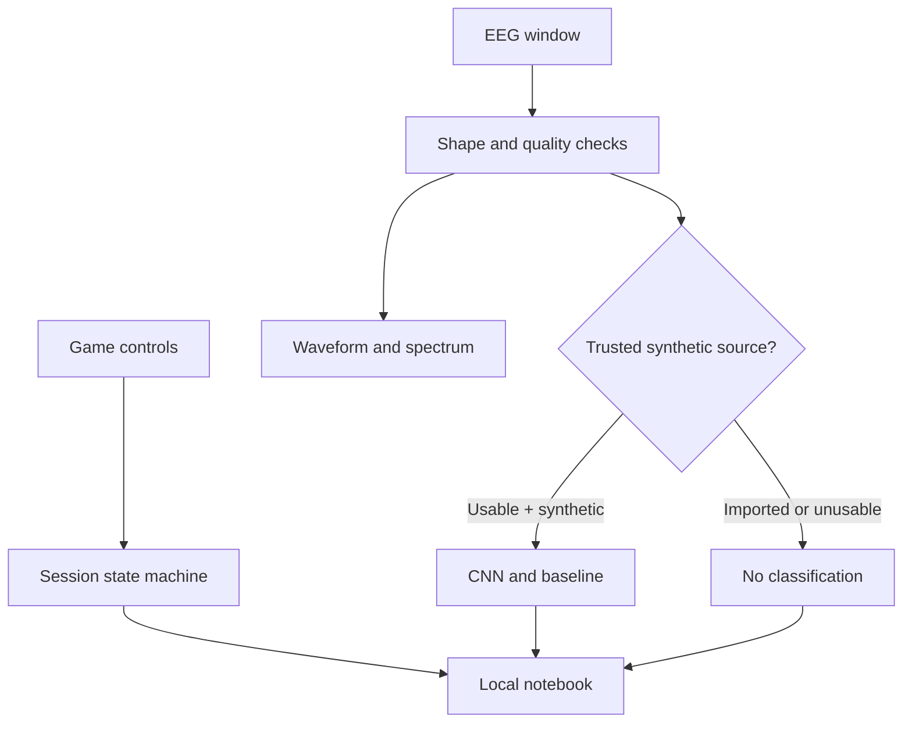

# Architecture

The offline console keeps interaction records separate from EEG analysis. Version 2 adds an independent Python training/evaluation pipeline on recorded EEG.

## Modules

`src/core.js` has deterministic signal generation, numeric functions, validation, CNN inference and the game state machine. `src/app.js` connects these to DOM controls, plots, event handlers and downloads. `src/style.css` supplies responsive presentation with local system fonts. `scripts/build.mjs` embeds all source, synthetic model weights, recorded EEG example and real/synthetic benchmark summaries into a single offline HTML file.

`research/neuro.py` holds the independent Python reference implementation; `research/train.py` fits and exports the model and baseline. `research/plot_report.py` renders exact scientific figures from the results. This legacy synthetic training script does not download data or need a GPU.

`research/real_eeg/` adds verified EDF acquisition, 64-channel referencing and offline filtering, motor-channel epochs, train-fitted reference models and a PyTorch CNN. `configs/` declares people and settings before training. Validation selects models; test predictions are recorded only after fitting. Exported state/JSON arrays support replay; a separate verifier checks hashes and recomputes metrics. CPU execution is supported.

Recorded replay in the browser displays a fixed processed trial and cohort results. The browser does not run the real CNN. Switching to synthetic replay enables the original synthetic decoder; imports always disable inference. Both acquisition/training and the standalone console work without an application backend.

## Interaction states

The state machine progresses through idle → preview → active → feedback, with the final scored round entering complete. Preview and active can enter paused; resume returns to the preceding state. Finish early enters stopped and leaves the unfinished round unscored. A new session replaces the current notebook only after the previous session is complete/stopped; export first if it needs to be kept.

Responses outside active are ignored. Monotonic timestamps prevent negative durations. Time spent paused during active is subtracted; preview time is excluded. Hidden tabs, section navigation and viewport resize pause a running session. Layout is recorded at the end of each completed round; it is not a path trace or a record of every layout change. A pause does not erase already-entered responses.

The mode and target size are locked while a session is in progress. Memory-length suggestions use the last four rounds only when all four share the current length. At least 75% correct suggests one step up; at most 25% suggests one step down, bounded to 2–4. Applying the suggestion is explicit and logged. These thresholds are interface rules, not a validated therapy prescription.

## Data lifetime and trust

All interaction state is in memory. Reloading closes the session. No cookies, localStorage, tracking, telemetry, web APIs, model CDN or data upload are used. File downloads require a user click. External GitHub/reference links in repository documentation are ordinary links, not runtime requests from the demo.

Imports are limited to 500,000 bytes, exact shape/rate/unit, unique short channel labels, finite values and bounded magnitude. The UI ignores declared provenance when deciding whether to classify: every import disables classification. Imported text is not inserted as HTML. SVG plots use bounded numeric arrays and XML-escaped channel labels, including imported labels.

Signal observations have an ISO observation time and provenance. They are independent snapshots, not hardware-synchronised EEG/event markers. Browser clocks and exported target geometry are unsuitable for calibrated physical or electrophysiological measurement without additional work.
