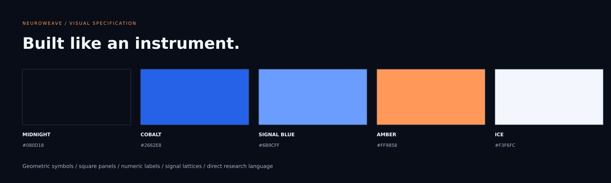

# NeuroWeave visual identity

Version 1.1 establishes NeuroWeave as a signal-analysis instrument and research console. Its visual vocabulary comes from signal routing, acquisition grids, geometric stimuli and inspectable model outputs.

| Role | Colour |
| --- | --- |
| Canvas | `#080D18` midnight |
| Panel | `#10192B` |
| Action | `#2662E8` cobalt |
| Signal and links | `#6B9CFF` |
| Artefact, annotation and contrast accent | `#FF9858` amber |
| Secondary trace | `#91D7F2` |
| Primary type | `#F3F6FC` |
| Supporting type | `#A6B2C8` |

Use bold sans-serif display type for the three-word identity, readable sans-serif for instructions and monospace for values, states and channel labels. Local system font stacks keep the demo independent of external font services. Panels have square or lightly rounded corners; thin rules and numbered labels establish hierarchy.

The NW mark uses a continuous angular line. The hero uses a layered signal lattice, originally drawn in SVG. Response pads contain Node, Pulse, Phase and Gate symbols, with text and key numbers so recognition does not depend on colour.

## Language

The principal line is **TRACE. DECODE. INTERACT.** Use direct, observable verbs: inspect, compare, load, record and export. The product areas are **Signal Console**, **Interaction Bench** and **Run Ledger**. The two tasks are **Sequence Buffer** and **Rule Router**.

Keep task instructions calm, explicit and self-paced even though the visual treatment is technical. Avoid treatment claims, mental-state labels or calling artificial signals measured EEG. Colours supplement textual states; an abstention is written explicitly.

## Artwork and maintenance

`scripts/brand.py` generates the original editable cover, signal lattice, system map and palette SVGs. `research/plot_report.py` plots actual recorded benchmark data using the same palette. Use Inkscape to render the SVG files to PNG when updating repository images. The frontend build embeds the lattice SVG into the standalone HTML.

Artwork is illustrative. It is not a UI screenshot or an EEG acquisition record. Display both the source and the interpretation boundary when scientific figures are shared.
